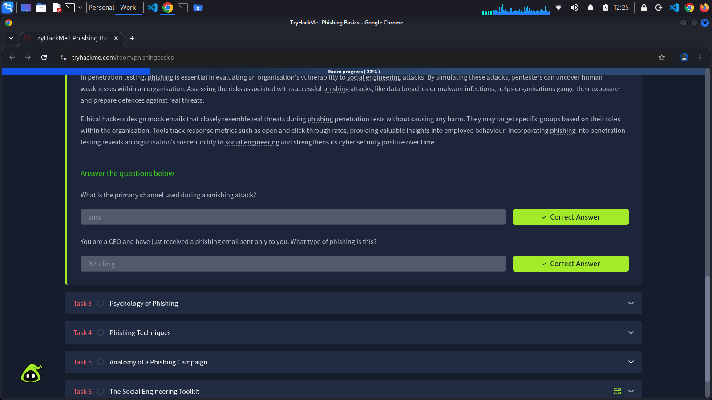

## What is *Phishing*?
Phishing is a form of cyber attack that uses **social engineering** to trick people into revealing sensitive information or running malware on their devices. Attackers deceive victims by impersonating legitimate source via emails, text messages, phone calls, or fake websites. Phishing exploits human psychology rather than technical vulnerabilities. Attackers craft believable narratives and apply pressure tactics to manipulate victims into compromising their security. The primary channels for phishing attacks include email, SMS (known as smishing), voice calls (vishing), and fake wesbites designed to look legitimate. Through phishing, attackers aim for financial gain, unauthorised access to sensitive data, or the installation of malware on a victim's device.

## Types of Phishing?
### Phishing
Phishing is the scam's broad, "cast a wide net" version. Attackers send the same believable message to many people at once, often using common themes like account alerts or invoices. These message feel routine rather than personal; any details are generic or slighty off. The aim is quick wins at scale: stolen passwords, card details, or a foothold on a device.

### Spear Phishing
Spear phishing is a targeted attack tailored to a specific person. The goal is usually to get the target to click a link, open a file, run a task, or submit credentials so the attacker can move deeper into the organisation's network.

### Whaling
Whaling is a spear phishing that targets senior decision-makers and executives, like CEOs and CFOs. Both spear phishing and whaling are targeted and customised attacks; the distinction is who is targeted and what leverage is expected. Spear phishing can hit anyone whose access enables a foothold (IT, finance, HR, project teams). Whaling concentrates on people whose decision-making pwoer can move money, expose regulated data, or override controls.

In penetration testing, phishing is essential in evaluating an organisation's vulnerability to social engineering attacks. By simulating these attacks, pentesters can uncover human weaknesses within an organisation. Assessing the risks associated with successful phishing attacks, like data breaches or malware infections, helps organisations gauge their exposure and prepare defences against real threats.

Ethical hackers design mock emails that closely resemble real threats during phishing penetrations tests without causing any harm. They may target specific groups based on their roles within the organisation. Tools track response metrics such as open and click-through rates, providing valuable insights into employee behaviour. Incorporating phishing into penetration testing reveals an organisation's susceptibility to social engineering and strengthens its cyber security psoture over time.

## Completed Tasks

