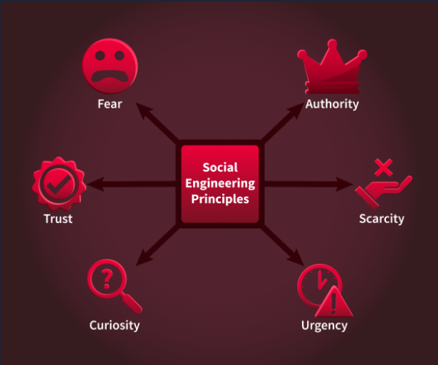

Phishing campaigns use social engineering techniques to manipulate emotions and influence decision-making. These tactics often exploit vulnerabilities in human psychology to increase the likelihood of success.

## Social Engineering Principles

### Scarcity
Scarcity makes something feel rare, which pushes people to act before they think. Psychologically, FOMO (fear of missing out) and loss aversion kick in: we dislike losing a chance more than we like gaining a benefit.

### Urgency
Urgency adds a countdown so the brain prioritises speed over scrutiny. Time pressure narrows attention and reduces deliberate checking, especially when the consequence sounds inconvenient (lockouts, delays). Language often includes "within 24 hours", "immediately", or "deadline passed".

### Fear
Fear uses threat and alarm to trigger a protective reaction, pushing people to "fix" the problem immediately. Anxiety can override usual scepticism, especially when the risk sounds personal (account compromise, legal trouble). Wording often includes "security alert", "breach", or "unauthorised access".

### Curiosity
Curiosity hooks attention by promising interesting information. The brain wants to close information gaps, which can outweigh caution when the tease feels relevant or exclusive. Subject lines are short, intriguing, and slighty vague.

### Trust
Trust piggybacks on familiar brands, colleagues, or communication styles so the message feels safe by default. Recognisable names, logos, or routines (monthly reports, ticket numbers) lower scepticism and make requests seem routine.

## Cognitive Biases
Cognitive bias is the tendency to make decisions based on feelings, assumptions, or past experiences instead of facts. These biases increase the risk of falling for phishing scams.
- **Overconfidence bias**: Many people, especially cyber security practitioners, think they're too smart to fall for phishing scams. However, this overconfidence can lead to less vigilance when checking suspicious messages.
- **Confirmation bias**: This happens when people accept information that fits their expectations. For instance, if someone is waiting for an email from their bank, they might trust a phishing email that pretends to be from the bank without verifying it.
- **Authority bias**: This leads people to trust messages from those they see as authority figures without question. An email that comes from a high-ranking official is more likely to be trusted than one from an unknown source.

Understanding these psychological principles is essential for pentesters simulating phishing campaigns. By including tactics like urgency and authority in phishing emails or fake landing pages, pentesters can test how well organisations defend against these social engineering attacks.
