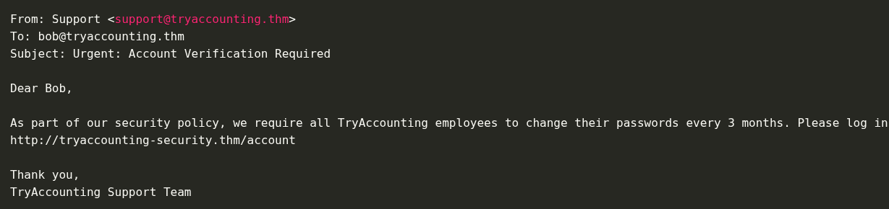
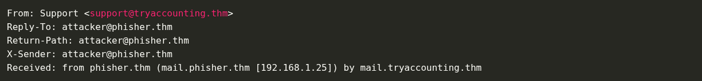
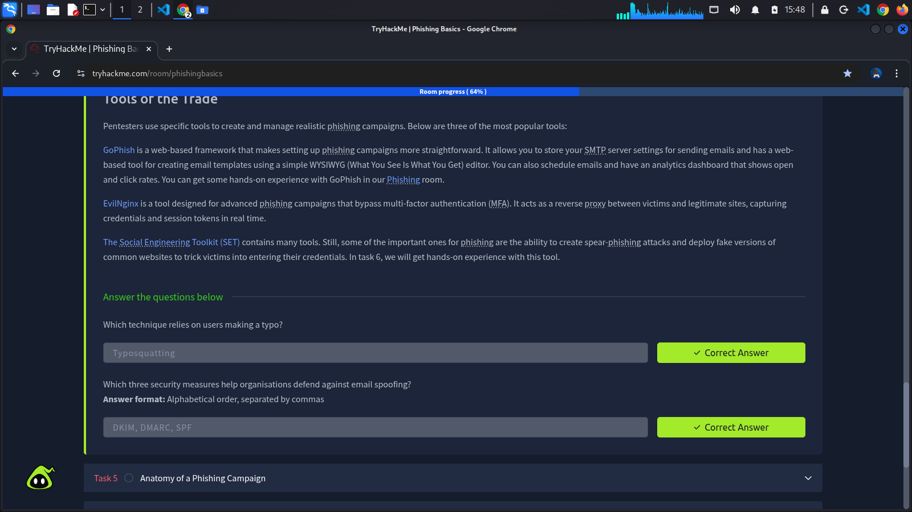

Phishing campaigns use technical manipulation to deceive targets and bypass defences. Here are some of the most common techniques attackers use to trick victims into interacting with malicious content.

## URL and Domain Manipulation
As a pentester, one of our primary goals is to get our target to click on a URL we control. To achieve this, we can use some of the technique below:
- **URL Masking**: Involves disguising a malicious IRL behind a legitimate-looking hyperlink. For example, an attacker might display *https://tryhackme.com* while redirecting users to *http://phisher.thm*.
- **Homograph Attacks**: Exploit visual similarities between domain name characters, for example, replacing "o" with "0" or using Cyrilic characters. An attacker might register a domain like 'goo0gle.com' that looks identical to the legitimate one but redirects users to a malicious site.
- **Typosquatting**: Involves registering domains similar to legitimate ones, relying on users making typing errors, for example, *tryhacme.com* instead of *tryhackme.com*. As a pentester, we can use these domains for phishing websites or malware delivery.

Attackers can use URL shorteners to hide a link's true destination. These URLs are more complicated for users to inspect and can bypass basic security checks.

## Email Spoofing Fundamentals
Email spoofing is a technique for impersonating a legitimate sender by modifying email headers. For example, we can spoof the "From" field to display a trusted sender's email address, like a manager or someone from HR. If a domain is lacking security measures for authentication, an attacker can use a Python script to modify their email address. This is possible because **SMTP (Simple Mail Transfer Protocol)** does not have built-in functionality for authenticating email addresses.

Display name spoofing involves changing the sender's name in an email client while keeping the actual email address hidden. For instance, we could display "IT Support" as our sender's name while using a Gmail address. Many mobile email clients only show the display name by default, hiding the actual email address, which makes this technique very effective.

Other technique involve using domains similar to legitimate ones, for example, *support@tryhackme-secure.com* instead of *support@tryhackme.com*, to trick recipient's into trusting the email.

Using some of these techniques, we can craft an email that would look like this on the recipients end:

At first glance, this looks like a perfectly legitimate email. Most email clients don't show these details by default, but if we were to look at the email headers, we would see the sender's true email.

Many organisations use security measures, such as **SPF** (Sender Policy Framework), **DMARC** (Domain-based Message Authentication, Reporting, and Conformance), and **DKIM** (DomainKeys Identified Mail), to help prevent such attacks. Although bypassing these security measures is outside the scope of this room, understanding the basics is crucial for building a strong foundation.

## Credential Harvesting
In a login cloning attack, the attacker replicates all visual elements of the legitimate website, including logos, fonts, and form fields, and hosts them on a deceptive domain. The primary distinction lies in the destination of submitted credentials. On the authentic side, credentials are transmitted to the organisation's authentication server. On the cloned page, credentials are sent to a script under the attacker's control, which logs them to a file or database. Subsequently, the victim is redirected to the legitimate site, minimising suspicion. As a result, the victim perceives only a failed login attempt, while the attacker acquires the victim's password.

## Payload Delivery Mechanisms
A frequently used delivery method involves a Microsoft Word document containing a macro. Upon opening the file, the victim encounters a prompt to "Enable Content" in order to  view the document, which serves as a built-in social engineering tactic. Once enabled, the VBA macro exectures silently in the background, In an actual attack, this macro may download and execute malware. During a penetration test, however, it is typically replaced with a benign beacon that merely checks in to inform execution without causing harm.

The typical sequence of events is as follows:
1. The victim receives and opens the .docm attachment.
2. Microsoft Word prompts the user to enable macros.
3. The victim clicks "Enable Content".
4. The VBA macro executes a hidden command.
5. The attacker receives confirmation of execution.

## Tools of the Trade
Pentesters use specific tools to create and manage realistic phishing campaigns. Below are three of the most popular tools:

**GoPhish** is a web-based framework that makes setting up phishing campaigns more straightforward. It allows us to store our SMTP server settings for sending emails and has a web-based tools for creating email templates using a simple WYSIWYG (What You See Is What You Get) editor. We can also schedule emails and have an analytics dashboard that shows open and click rates.

**EvilNginx** is a tool designed for advanced phishing campaigns that bypass multi-factor authentication (MFA). It acts as a reverse proxy between victims and legitimate sites, capturing credentials and session tokens in real time.

**The Social Engineering Tookit (SET)** contains many tools. Still, some of the important ones for phishing are the ability to create spear-phishing attacks and deploy fake versions of common websites to trick victims into entering their credentials.

## Completed Tasks

