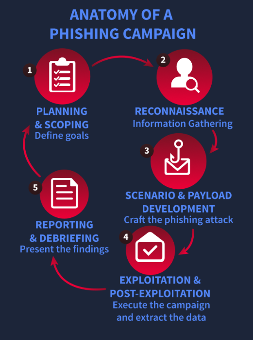
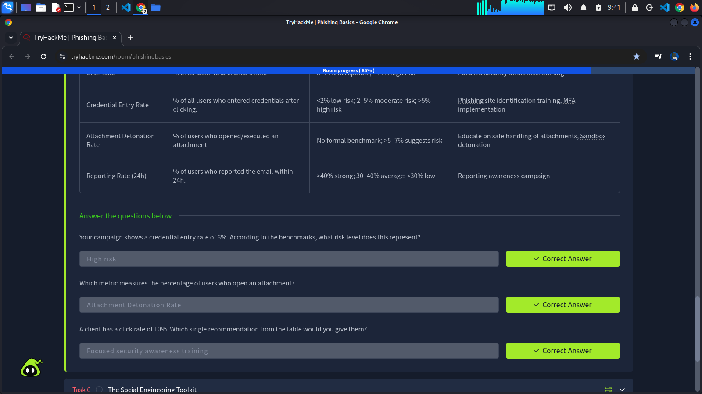

Phishing campaigns are not just about sending random emails and hoping someone clicks on a malicious link. They requre extensive planning, reconnaissance, execution, and post-attack analysis to succeed. A phishing exercise is only impactful if it ends with a report that decision-makers can act on.

### Planning and Scoping
Start by agreeing on the mission with the client and writing it down in one sentence. Define which user groups are in or out, the techniques in bounds, and the specific outcomes to measure, for example, separating "clicked a link" from "attempted to submit credentials". Set the campaign timing and message volume, secure legal sign-off, and record the rules of engagement, an explicit kill switch, and emergency contacts so the exercise remains authorised, safe, and reversible.

### Reconnaissance
Use only public information to make lures feel plausible without crossing privacy lines. Company websites, press releases, LinkedIn profiles, public social posts, and relevant news provide enough context to craft believable pretexts, such as referencing a recent announcement or policy change. Keep all collections within scope and document sources so as to make sure that the research stayed ethical and limited to OSINT.

### Scenario and Payload Development
Turn the intel into realistic but harmless messages: an invoice reminder, an IT notification, or a HR update that looks and reads like the real thing. Payloads should support learning, not exploitation: tracking links, branded landing pages that capture metadata, and benign attachments are appropriate. Avoid malware and live credential capture entirely. Use simulated login pages and fake accounts to measure risk-free behaviour.

### Exploitation and Post-Exploitation
Run the campaign according to the agreed plan, either in staggered waves or as a single send, and monitor opens, clicks, simulated submissions, and reports in real time. Keep the kill switch and escalation path visible to the team and pause immediately if messages leak outside the scope or trigger unintended consequences. Use lab-safe tooling, such as GoPhish or an equivalent sandboxed platform, and only target real users after obtaining prior written authorisation.

### Reporting and Debriefing
Analyse what happened and why: click rates, submission attempts, reporting behaviour, and timing across teams. Present findings without naming individuals and focus on practical improvements like targeted training, phishing-resistant MFA, SPF/DKIM/DMARC configuration, and other technical controls that reduce risk, close with agreed follow-up actions and a sensible cadence for re-testing so progress can be measured over time.

### Recommendations Table
A phishing simulation provides value only when its results are communicated clearly to the client. The responsibilities of a penetration tester extend beyond the conclusion of the campaign; it is essential to translate raw metrics into actionable findings. The following table offers a framework for this process: given a metric and its benchmark, appropriate recommendations can be formulated. This approach reflects the structure of a professional phishing report.

---
|Metric|What it measures|Benchmark|Suggested Recommendation(s)|
|------|----------------|---------|---------------------------|
|Open Rate|% of users who opened the email.|Indutry varies; typical phishing open rates ~50-65%|Targeted refresher training|
|Click Rate|% of all users who entered credentials after clicking|<2% low risk; 2-5% moderate risk; >5% high risk|Phishing site identification training, MFA implementation|
|Attachment Detonation Rate|% of users who opened/executed an attachment.|No formal benchmark; >5-7% suggests risk|Educate on safe handling of attachments, *Sandbox* detonation|
|Reporting Rate (24h)|% of users who reported the email within 24h.|>40% strong; 30-40% average; <30% low|Reporting awareness campaign|
---

## Completed Tasks

