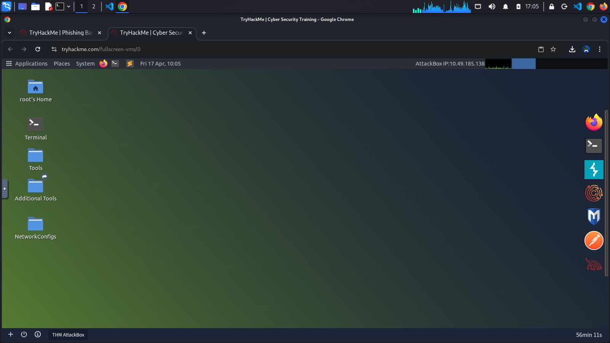
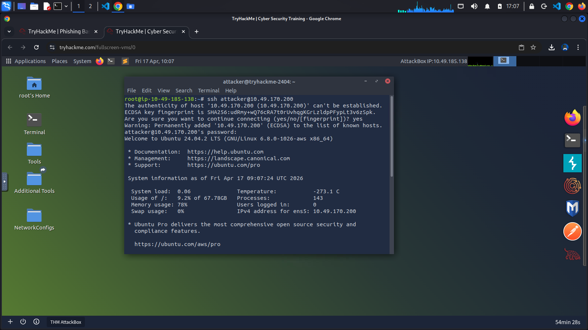
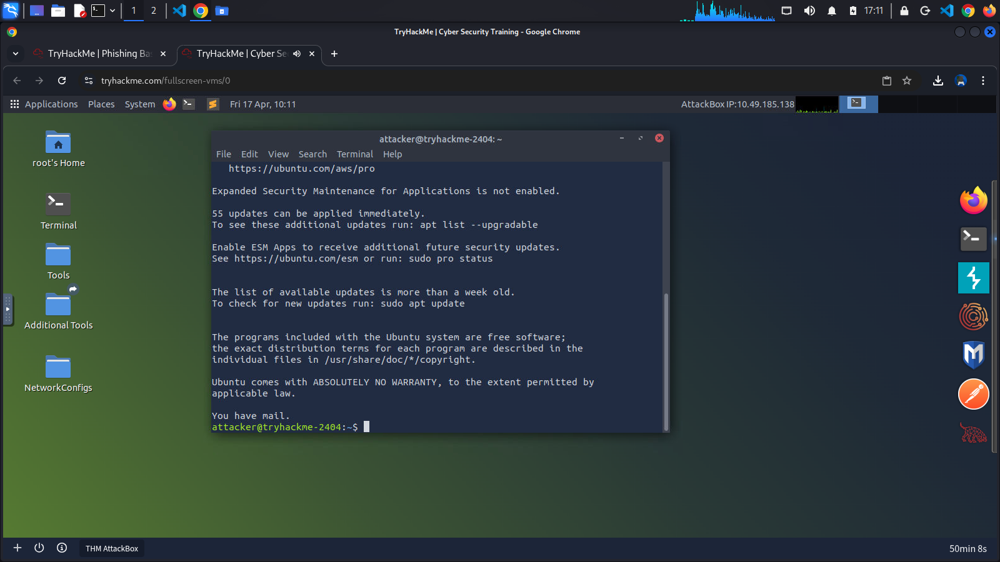
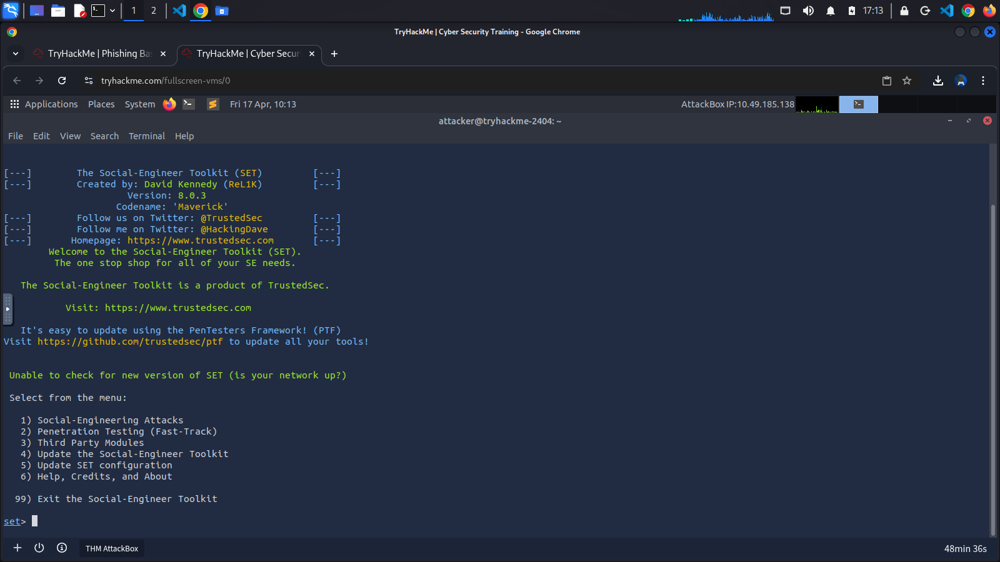

Scenario
After our OSINT investigation, we have finally identified a good target for our spear-phishing attack: Bob, the head of finance at TryAccounting. Through LinkedIn, we found this email address: bob@tryaccounting.thm. In one of their job offers for a cyber security engineer, we learnt that they:
- Have a strict password policy (can be used as a good pretext in our phishing email)
- Use email security, so we might need to perform some basic email spoofing
Our goal is to obtain Bob's credentials, so we will create a phishing web app to harvest them.

First, connect to the TryHackMe Attack Box (VM).

### Preparing the Attack
Then, SSH into the VM with the provided credentials on the website: [Below are my credentials provided during the session]

---
|Username|Password|IP Address|Connection via|
|--------|--------|----------|--------------|
|attacker|attacker1234|10.49.170.200|ssh attacker@10.29.170.200|
---

Next, we need to run the Social Engineering Toolkit. There is an alias on the VM to make things easier: Just type SET and hit enter.

As you can see, we can choose from several modules. For this practical, we will set up a credential harvester with custom HTML. This will allow us to set up a phishing site using our own HTML.

Select the first option, Social-Engineering Attacks:

