### Scenario
After our OSINT investigation, we have finally identified a good target for our spear-phishing attack: Bob, the head of finance at TryAccounting. Through LinkedIn, we found this email address: bob@tryaccounting.thm. In one of their job offers for a cyber security engineer, we learnt that they:
- Have a strict password policy (can be used as a good pretext in our phishing email)
- Use email security, so we might need to perform some basic email spoofing

Our goal is to obtain Bob's credentials, so we will create a phishing web app to harvest them.

First, connect to the TryHackMe Attack Box (VM).

### Preparing the Attack
Then, SSH into the VM with the provided credentials on the website: [Below are my credentials provided during the session]

---
|Username|Password|IP Address|Connection via|
|--------|--------|----------|--------------|
|attacker|attacker1234|Provided MACHINE_IP|ssh attacker@MACHINE_IP|
---

Next, we need to run the Social Engineering Toolkit. There is an alias on the VM to make things easier: Just type SET and hit enter.

As you can see, we can choose from several modules. For this practical, we will set up a credential harvester with custom HTML. This will allow us to set up a phishing site using our own HTML.

Select the first option, **Social-Engineering Attacks**:

Then, we will select the second option, **Website Attack Vectors**, and then the third option, **Credential Harvester Attack Method**:

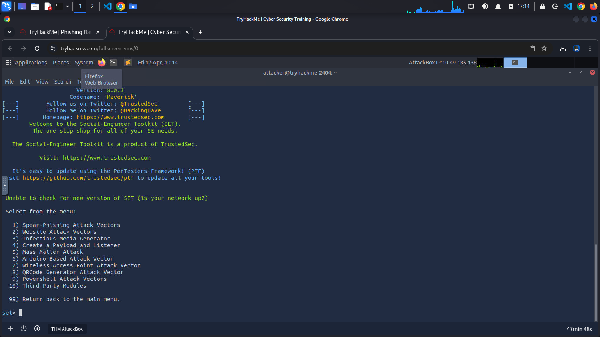

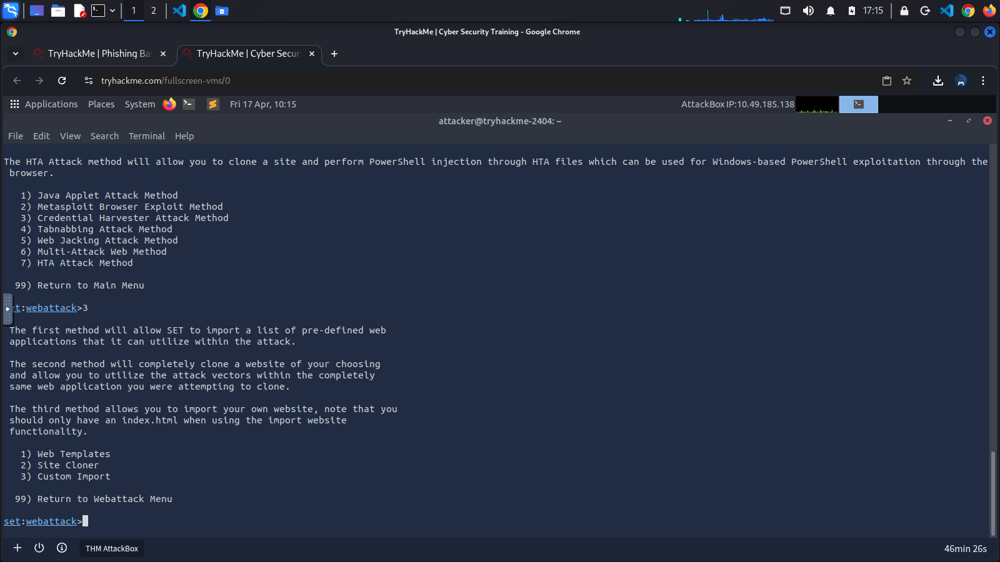

Choose the third option, **Custom Import**, so we can use our own HTML file. During a real campaign, we would use the "Site Cloner" option to create a realistic copy of our target's web app. When prompted for an IP address for the POST back, ensure that the IP is the same as the *MACHINE_IP*:

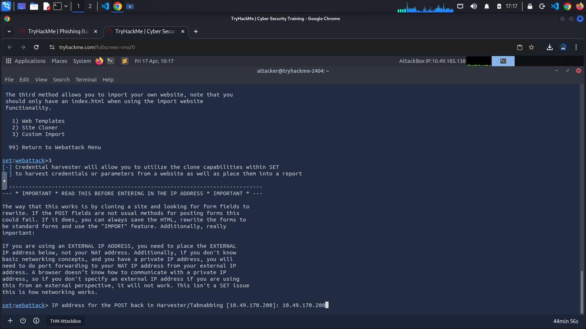

Then, provide the following path for index.html */home/attacker/setoolkit/* and choose the first option, **Copy just the index.html**. And finally, enter the following URL: *http://tryaccounting.thm*, and press enter:

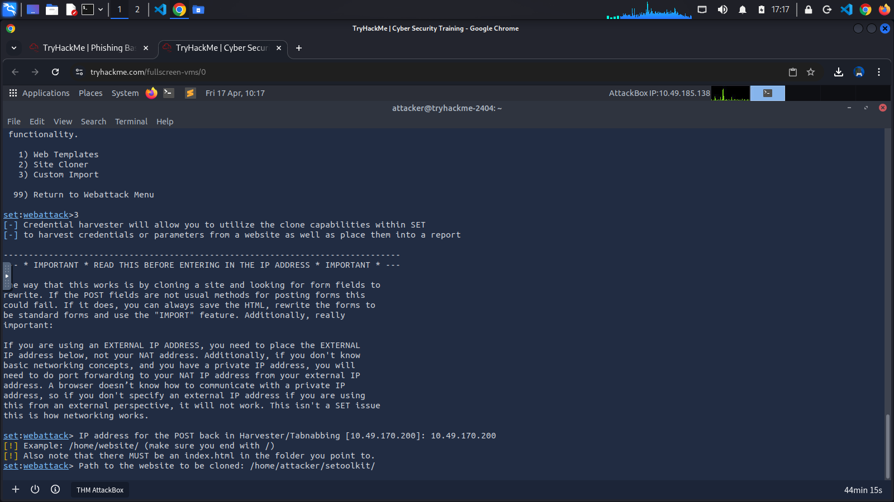

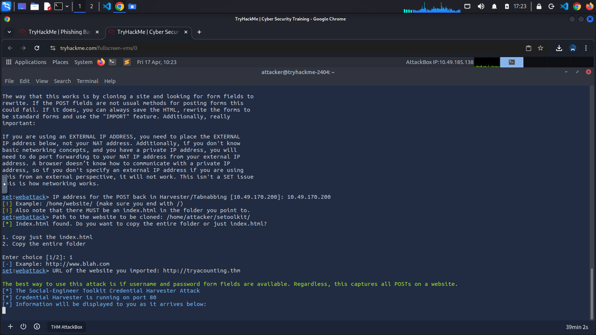

We should see output indicating that our **Credential Harvester is running on port 80**. We can view the result by accessing *http://MACHINE_IP* in the browser:

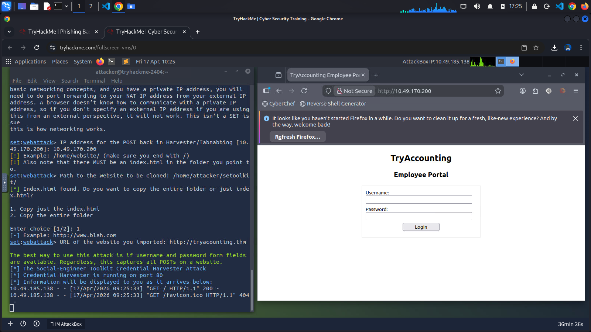

## Time to Get Phishy
The next step will be to create and send our phishing email. Head over to *http://MACHINE_IP:8080* via our Attackbox browser, and log in to the Rainloop client with the following email **attacker@phisher.thm** and the password **attacker**.

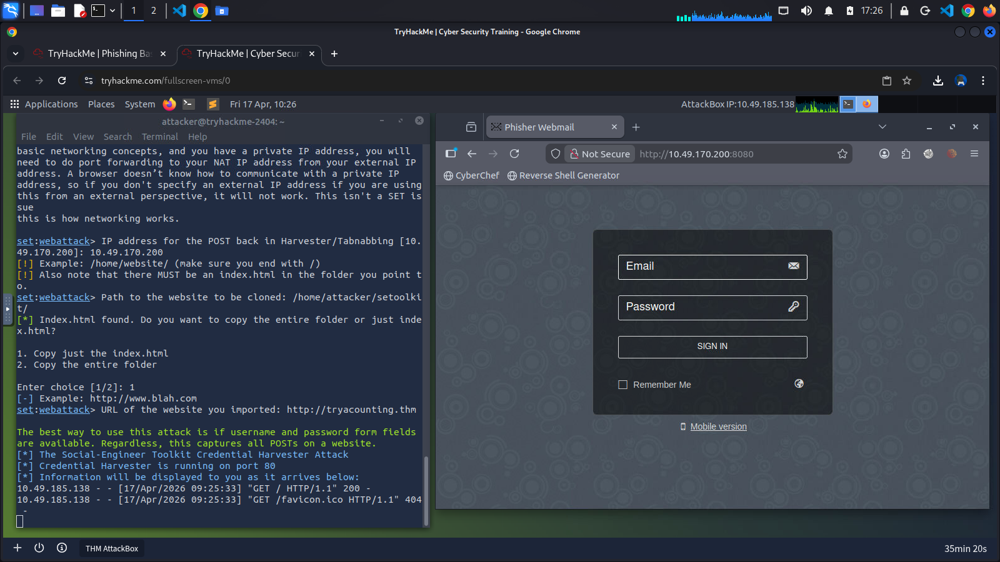

During our reconnaisance phase, we discovered that TryAccounting may use email security. If we try to send an email to our target, *bob@tryaccounting.thm*, we will get the following response:

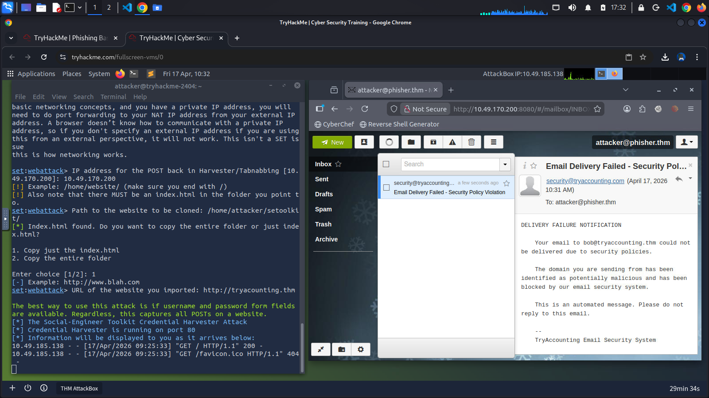

In Rainloop, we can use aliases to help us with basic spoofing.

Click on the "New Message" button, then in the new email, click on our attacker's email next to the "From" field, and select *support@tryaccounting.thm* from the dropdown, so we can make it look like we are an employee sending an internal email to *bob@tryaccounting.thm*:

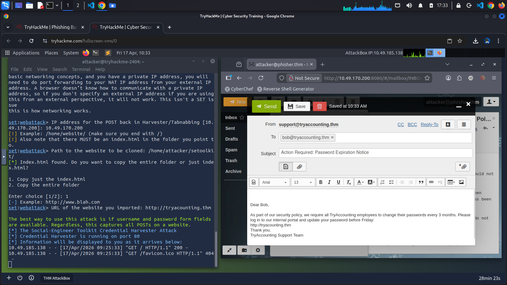

Use the email below and come up with a convincing subject, for example, "Action Required: Password Expiration Notice":

    Dear Bob,

    As part of our security policy, we require all TryAccounting employees to change their passwords every 3 months. Please log in to our internal portal and update your password before Friday:
    http://tryacounting.thm.

    Thank you,
    TryAccounting Support Team

Finally, we can send this email to Bob. And this time, we didn't receive the email security notification. If we go back to our terminal window, we should see their credentials.

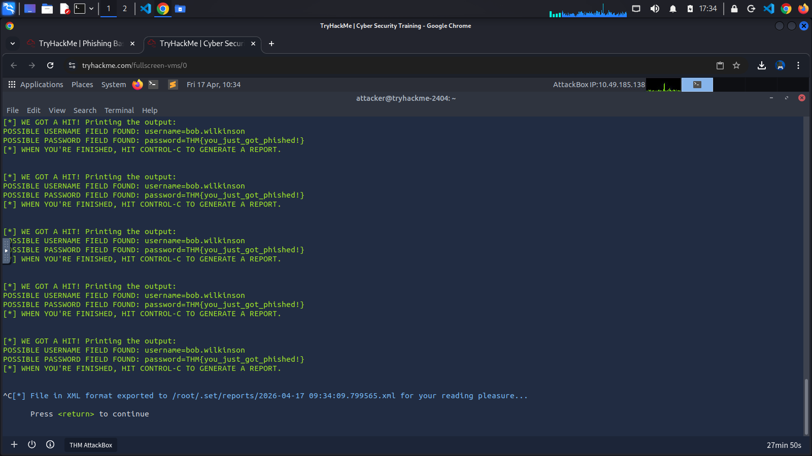

## Completed Task

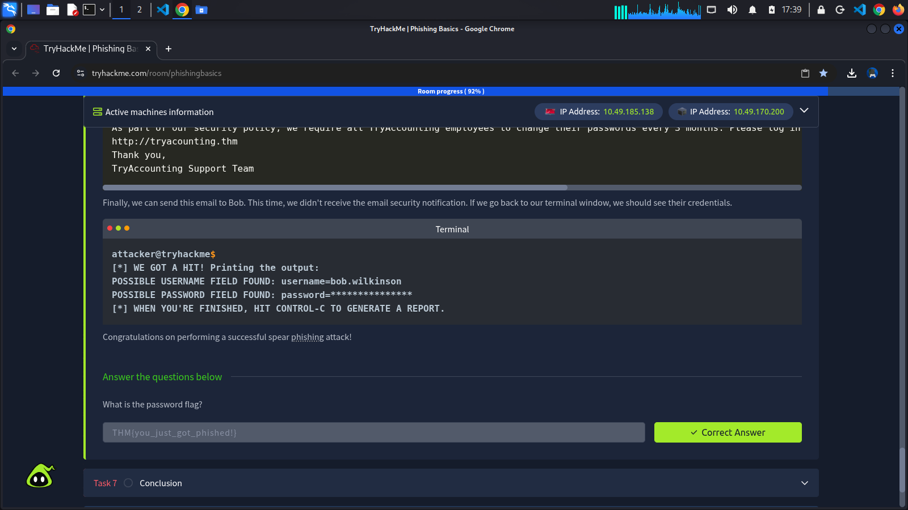

